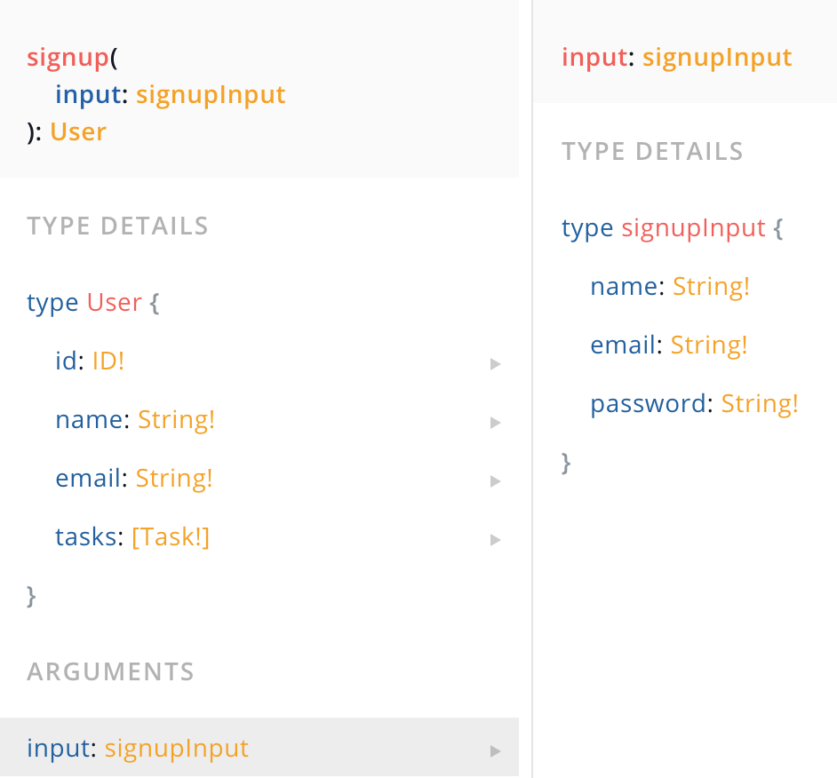

# Quiz 3- Resolvers
[10/21 - Udemy 24. Signup Mutation]

**Q1: Write resolver for below type definition**
```js
type Mutation {
  signup(input: signupInput): User
}

input signupInput {
  name: String!
  email: String!
  password: String!
}

```

**A1:**

```js
const bcrypt = require("bcryptjs");
const User = require("../database/models/user");

module.exports = {
  Mutation: {
    signup: async (_, { input }) => {
      try {
        const user = await User.findOne({ email: input.email });
        if (user) {
          throw new Error("Email already in use");
        }
        const hashedPassword = await bcrypt.hash(input.password, 12);
        const newUser = new User({ ...input, password: hashedPassword });
        const result = await newUser.save();
        return result;
      } catch (error) {
        console.log(error);
        throw error;
      }
    },
  },
};
```
<hr />

**Q2 Run signup mutation using playground:**




**A1: GQ playground**

```js
mutation createUser{
   signup(input: {name: "hiroko", email: "hiroko@test.com", password: "123"}) {
    id
    name
    email
  }
}
```

<hr />


## References:


<!--
**Q1:**
```js
````

**A1:**

```js

```

<hr />
**Q1:**
```js
```
**A1:**
```js
```
<hr />
**Q1:**
```js
```
**A1:**
```js
```
<hr />
**Q1:**
```js
```
**A1:**
```js
```
<hr />
**Q1:**
```js
```
**A1:**
```js
```
<hr /> -->
