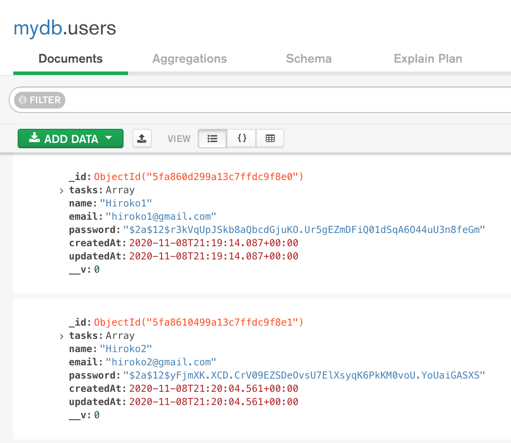

# Signup Mutation

udemy 24. Signup Mutation

## Schema.js
```js
const typeDefs = gql`
  scalar Date

  type Mutation {
    signup(input: signupInput): User
  }	

  input signupInput {
    name: String!
    email: String!
    password: String!
  }	
`	
```

## Resolver

```js
const bcrypt = require("bcryptjs");
const { tasks, users } = require("../constants");
const User = require("../database/models/user");

module.exports = {
  Mutation: {
    signup: async (_, { input }) => {
      try {
        const user = await User.findOne({ email: input.email });
        if (user) {
          throw new Error("Email already in use");
        }
        const hashedPassword = await bcrypt.hash(input.password, 12);
        const newUser = new User({ ...input, password: hashedPassword });
        const result = await newUser.save();
        return result;
      } catch (error) {
        console.log(error);
        throw error;
      }
    },
};
```

## Playground

```js
mutation createUser{
  signup(input: { name: "Hiroko4" email: "hiroko4@gmail.com" password:"hiroko4"}){
    id
    name
    email
    createdAt
    updatedAt
  }
}
```

## Database


## References: 
 