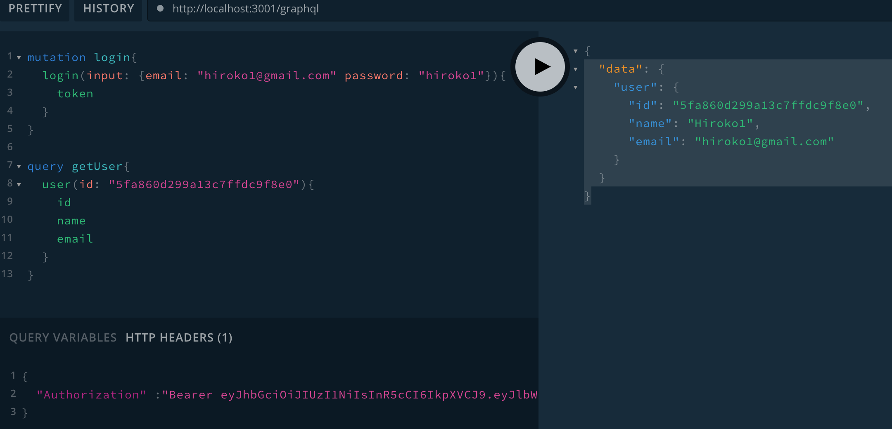
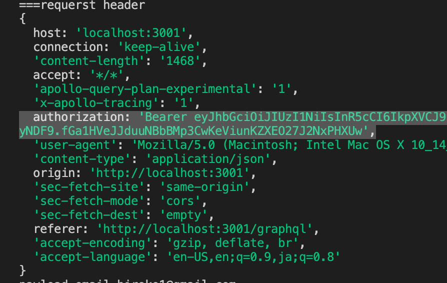
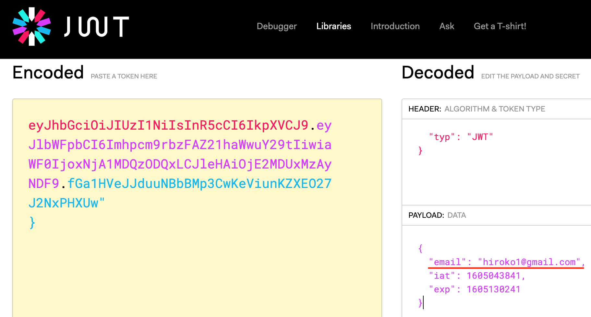

# Verify Token


**Playground HTTP Headers Format**
```js
{
  "Authorization" :"Bearer [token]"
}
```



**Verify Token**

```js
// login mutation
const token = jwt.sign({ email: user.email }, secret, {
  expiresIn: "1d",
});

// Verify Token in Context
const payload = jwt.verify(
  token,
  process.env.JWT_SECRET_KEY || "mysecretkey"
);
req.email = payload.email;
```

**Context function**
```js
const verifyUser = async (req) => {
  try {
    req.email = null;
    const bearerHeader = req.headers.authorization;
    if (bearerHeader) {
      const token = bearerHeader.split(" ")[1];
      const payload = jwt.verify(
        token,
        process.env.JWT_SECRET_KEY || "mysecretkey"
      );
      req.email = payload.email;
    }
  } catch (error) {
    console.log(error);
    throw error;
  }
};

const apolloServer = new ApolloServer({
  typeDefs,
  resolvers,
  context: async ({ req }) => { // Context returns user email
    await verifyUser(req);
    return {
      email: req.email,
    };
  },
});
```



## References:
- https://www.npmjs.com/package/jsonwebtoken
- https://jwt.io/