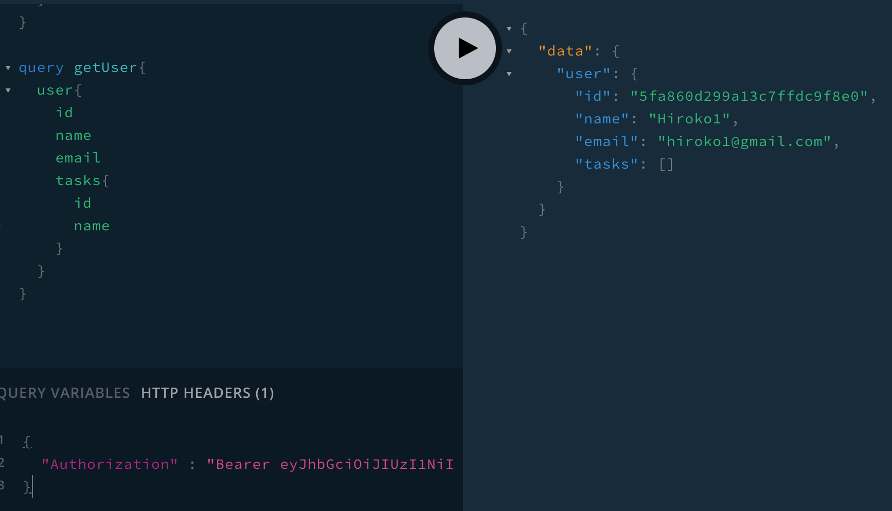

# Get User By Id 

30 Udemy

## Field Level Resolver




**Schema**

```js
type User {
  id: ID!
  name: String!
  email: String!
  tasks: [Task!] // Relational
  createdAt: Date!
  updatedAt: Date!
}
```

**Model**

```js
const userSchema = new mongoose.Schema(
  {
    name: {
      type: String,
      required: true,
    },
    email: {
      type: String,
      required: true,
    },
    password: {
      type: String,
      required: true,
    },
    tasks: [ // Relational
      {
        type: mongoose.Schema.Types.ObjectId,
        ref: "Task",
      },
    ],
  },
  {
    timestamps: true,
  }
);
```


**Field Level Resolver**


```js
  User: {
    tasks: async ({ id }) => {
      try {
        const tasks = await Task.find({ user: id });
        return tasks;
      } catch (error) {
        console.log(error);
        throw error;
      }
    },
  },
```